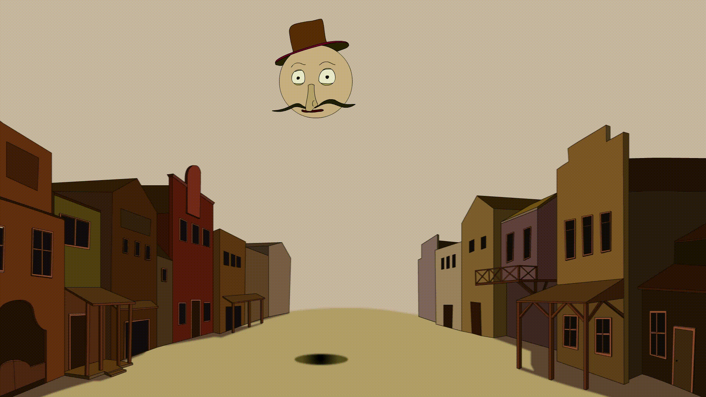
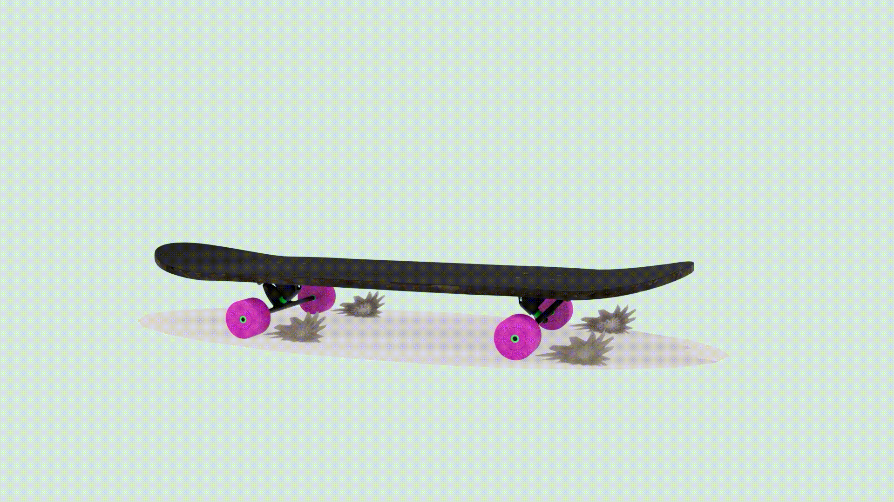
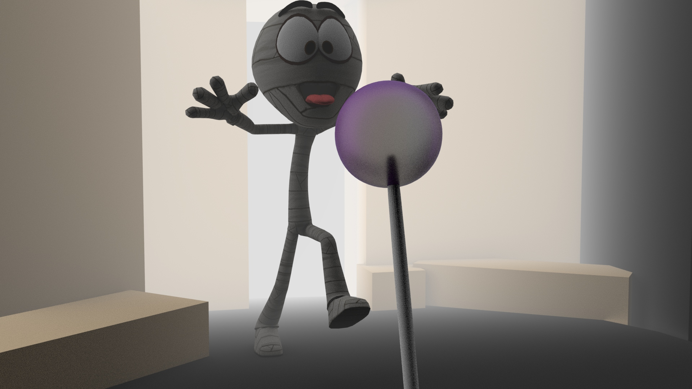
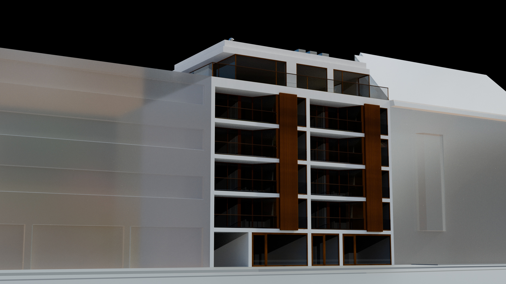
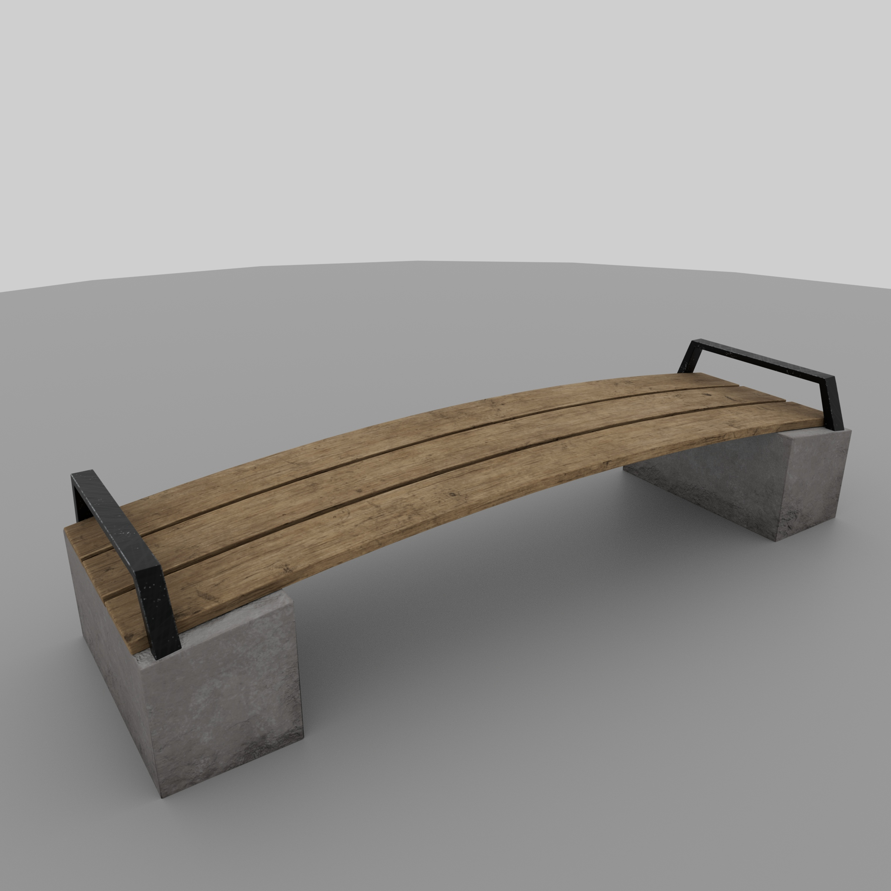
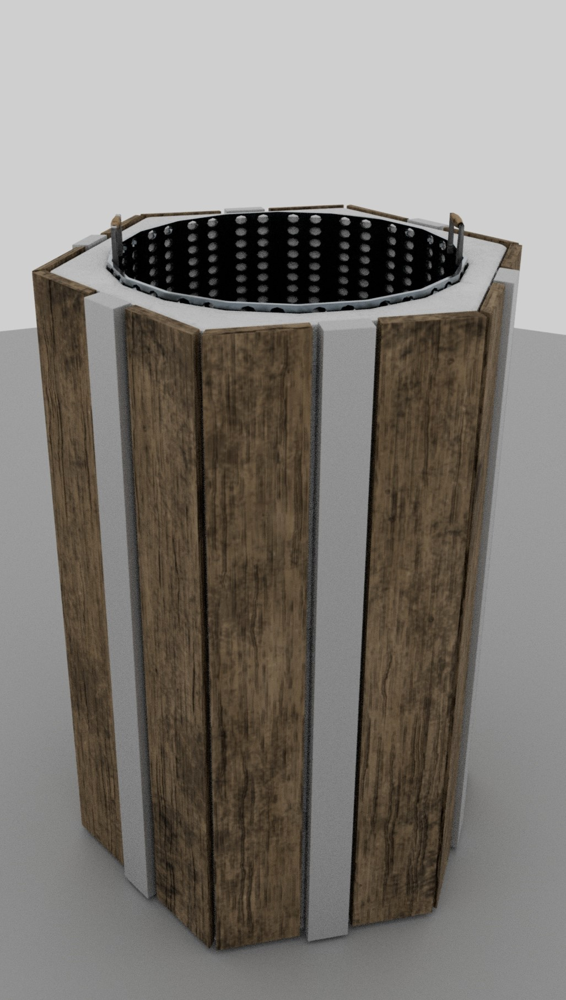
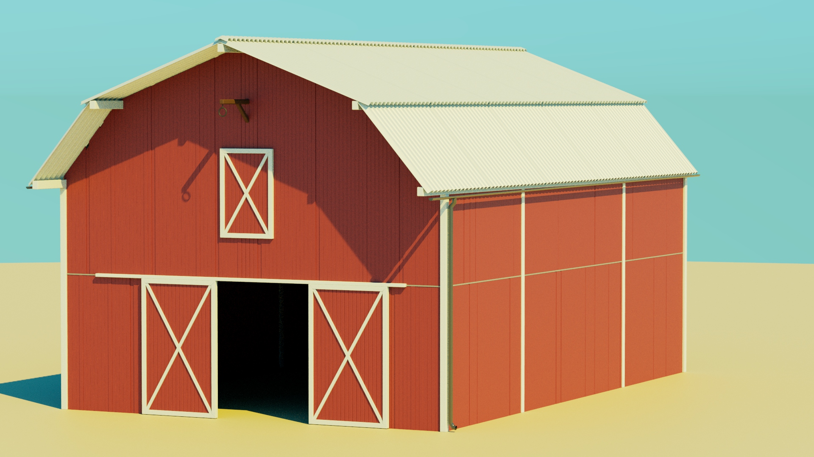
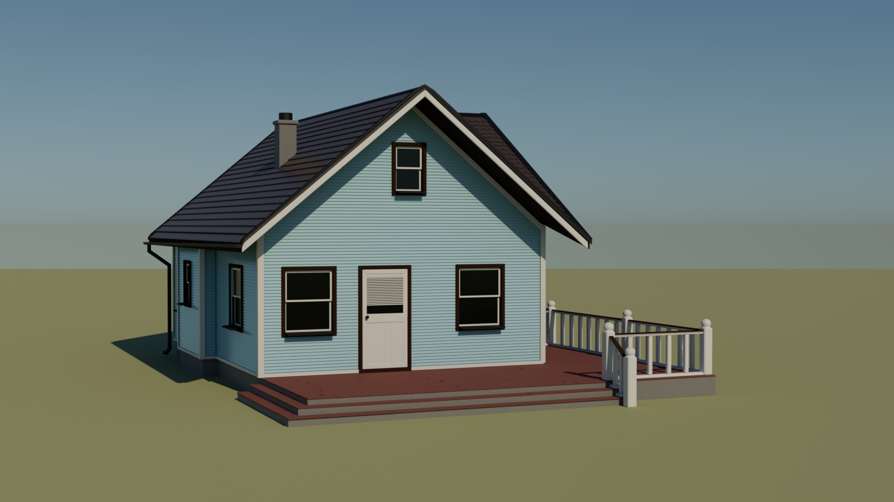

- ### [Matěj Kníže](https://matej-knize.github.io/english-for-designers/03-content-first/)
   
# My work

I love to make animations in all ways.  
I have started this journey with 2D and now I'm most into the 3D stuff where I have less limitations and can create literally anything I can imagine. 

****

***There are samples of my 2D animations from school work.***

     
  

****

***And these are some of my 3D works.***

   

****

In these days, I've been returning to architectural themes in my work, and finally, I'm slowly finding where I'd like to settle in my artistic career. Now I think, i would be nice to be a part of game dev. studio and creating some 3D stuff for them.

And there are fragments from my latest work.

 

 
