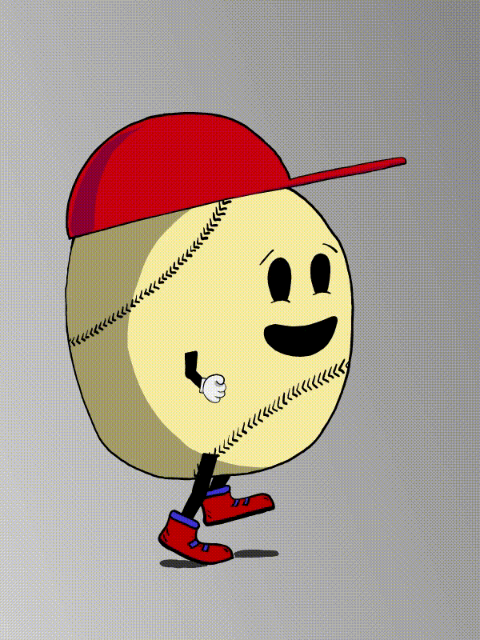

- ### [Matěj Kníže](https://matej-knize.github.io/english-for-designers/03-content-first/)
   
# My work

I love to make animations in all ways.  
I have started this journey with 2D and now I'm most into the 3D stuff where I have less limitations and can create literally anything I can imagine. 

****

There are samples of my 2D animations from school work.

    

 hh
